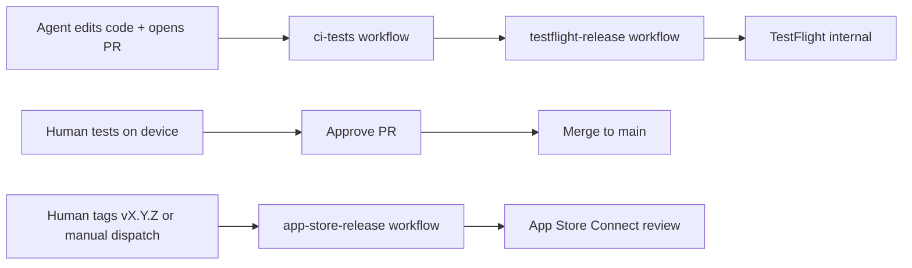

# Agent guide — MusicWall (iOS)

This repo is a **SwiftUI + MusicKit** iOS app. Most agent work is Swift source under `MusicWall/`. Builds, signing, and distribution run on **GitHub Actions (`macos-26`, Xcode 26)** — not on Linux cloud agents.

## CI/CD loop (human vs automation)



| Stage | Trigger | What runs | Human |
|-------|---------|-----------|-------|
| Fast feedback | PR push or push to `main` | `ci-tests` runs simulator unit tests (`ci_tests`) | Optional |
| Feature validation | PR push (default, after `ci-tests` passes) | `testflight-release` runs match → build → **TestFlight internal** | **Test on device** before approving PR |
| Store release | Push tag `v*` (e.g. `v1.2.0`) or **Actions → App Store Release → Run workflow** with version `1.2.0` | Upload + **submit for review**; **automatic release** after Apple approves | Monitor in App Store Connect (no manual Release click) |

**Rules for agents**

- Do **not** commit secrets, `.p8`, `.p12`, passwords, or `AuthKey_*` files.
- Do **not** commit `xcuserdata/` or `DerivedData/`.
- Do **not** change `DEVELOPMENT_TEAM` or bundle ID without explicit human request.
- Prefer small, focused PRs; one feature per PR when possible.
- If a change is docs-only or trivial, tell the human to add label **`no-deploy`** (or add it if you have permission) to skip TestFlight upload.

**PR comment bot** (after implementation): preview workflow posts TestFlight build number and status — reference that number in review notes.

## Project layout

```
MusicWall/                 # App source (SwiftUI views, services, models)
MusicWallTests/            # Deterministic unit tests and test-specific guidance
MusicWall.xcodeproj/       # Xcode project — scheme: MusicWall
fastlane/                  # match, build, upload lanes
.github/workflows/         # ci-tests.yml, testflight-release.yml, app-store-release.yml
docs/specs/                # Design specs
docs/plans/                # Implementation plans
```

- **Bundle ID:** `chris.MusicWall`
- **Deployment target:** See `IPHONEOS_DEPLOYMENT_TARGET` in `project.pbxproj` (keep CI Xcode version compatible).
- **MusicKit:** Requires correct App ID capability; real playback/auth needs **device + TestFlight** — simulator is insufficient for full validation.

## iOS / Swift best practices (this codebase)

### Architecture

- **SwiftUI** for UI; use `@Observable`, `@State`, `@Environment` consistently with existing files.
- **MVVM-style separation:** views in `*View.swift`, Apple Music access via `AlbumRepository` / `PlaybackController` (`AppDependencies.live`), album artwork via `ArtworkProvider` + `ImageCache`, tap-to-play via `AlbumTapCoordinator` + `PlaybackController`, persistence via `PreferencesStore` / `AlbumBackupService`. Home orchestration via `HomeViewModel` in `Features/Home/`; search via `SearchViewModel` in `Features/Search/`; album edit via `AlbumEditViewModel` in `Features/Edit/`. Search errors surface as inline `errorMessage` in the search sheet (not snackbar). `HomePageView` has no direct `albumBackupService` calls.
- Keep views thin; move testable logic into types/functions that do not require `MusicPlayer` when possible.
- **Testing & coverage:** see `MusicWallTests/Agent.md` (commands, UI launch args, ViewInspector, coverage thresholds).

#### Layers and folders

```
MusicWall App (SwiftUI, ViewModels, AppDependencies)
    │
    ├── Core/           Foundation only — domain types + protocols
    ├── Adapters/       I/O and MusicKit implementations
    └── Features/       *ViewModel.swift + views per feature area
```

| Folder | Put here | Examples |
|--------|----------|----------|
| `MusicWall/Core/` | App-owned types, pure logic, protocols | `AlbumRecord`, `AlbumSorter`, `BackupCodec`, `AlbumRepository`, `PreferencesStore`, `ArtworkProvider` |
| `MusicWall/Adapters/` | Side effects, platform APIs, MusicKit | **Persistence:** `UserDefaultsPreferencesStore`, `FileExportService`, `LiveAlbumBackupService`, `AlbumLibraryLoader`, `SecurityScopedResourceReader`. **MusicKit:** `MusicKitAlbumRepository`, `AlbumMapper`, `SystemMusicPlayerAdapter`, `MusicKitArtworkProvider`, `LiveMusicAuthorizationProvider` |
| `MusicWall/Features/<Area>/` | Screen state and UI for one flow | `HomeViewModel`, `HomePageView`, `SearchViewModel`, `AuthViewModel` |
| `MusicWall/` (root) | App shell, design system, composition | `MusicWallApp`, `AppDependencies`, `ImageCache`, `LayoutViews`, `SnackbarView` |

CI runs `Scripts/check_core_imports.sh` — `MusicWall/Core/` must not import MusicKit, SwiftUI, or UIKit.

#### Design rules

| Rule | Rationale |
|------|-----------|
| Core has zero MusicKit / SwiftUI / UIKit imports | Fast, deterministic unit tests |
| Domain types are app-owned (`AlbumID`, `AlbumRecord`) | Tests do not construct `MusicKit.Album` |
| No playback on model types | Use `PlaybackController` + `AlbumTapCoordinator` |
| Views do not call repositories directly | ViewModels own async work; views bind only |
| Single composition root (`AppDependencies.live`) | Previews and tests swap fakes; leaf views may use `@Environment` for services |
| Side effects at adapter boundaries | Core logic stays testable without I/O |
| Map MusicKit errors to domain errors in adapters only | ViewModels surface user-visible errors |

#### Where new code goes

| You are adding… | Location |
|-----------------|----------|
| Protocol or domain type | `MusicWall/Core/` |
| UserDefaults, files, security-scoped I/O | `MusicWall/Adapters/` (no MusicKit unless mapping Apple types) |
| MusicKit search, playback, authorization, artwork | `MusicWall/Adapters/` |
| CarPlay templates, scene delegate | `MusicWall/Adapters/CarPlay/` |
| Screen logic or async UI state | `MusicWall/Features/<Area>/*ViewModel.swift` |
| SwiftUI layout | `MusicWall/Features/<Area>/*View.swift` or shared design-system files |
| Test doubles | `MusicWallTests/TestSupport/` |

#### Composition and injection

- **Production:** `AppDependencies.live` wires live adapters; install services on the SwiftUI tree from `HomePageView` (environment keys for `albumRepository`, `playback`, etc.).
- **Previews / unit tests:** `AppDependencies.preview()` or mocks in `MusicWallTests/TestSupport/` — never require live MusicKit in unit tests.
- **`AlbumRecord` fields:** `id`, `title`, `artistName`, `releaseDate`, `isExplicit`.

#### Human verification (not unit-tested)

- Live `MusicAuthorization` on device
- Catalog/library search with live Apple Music
- `SystemMusicPlayer` playback
- CarPlay Audio (requires Apple entitlement approval + physical device or CarPlay simulator; see `docs/specs/2026-05-31-carplay-design.md`)
- Internal TestFlight build (existing CI loop)

### MusicKit

- Use `AlbumRepository` for catalog/library search and fetch — do not duplicate MusicKit request types across views.
- Authorization via `AuthViewModel` + `MusicAuthorizationProviding` (`AppDependencies.musicAuthorization`); `ContentView` in `Features/Auth/` binds to VM state only.
- Do not log user tokens or private listening data.

### UI

- Reuse `LayoutViews` (grid/list), `SnackbarView`, `ImageCache` patterns.
- Support Dynamic Type and accessibility labels where you touch interactive controls.
- Avoid blocking the main actor in async MusicKit calls — use `async/await` as in existing code.

### Data & persistence

- Album collections use **UserDefaults** and backup JSON — preserve backward compatibility when changing encoded shapes.
- Version export/import via `AlbumBackupService` (`LiveAlbumBackupService` + `BackupCodec`) — test round-trip when changing `Album` model.

### Code quality

- Match existing naming and file placement; no drive-by refactors.
- Prefer compiler-driven safety over force-unwraps.
- Add **unit tests** under `MusicWallTests/` for pure logic and composition-root smoke coverage — not required for every UI tweak.

### Xcode project

- Target uses **filesystem-synchronized** `MusicWall/` group — new Swift files under `MusicWall/` are picked up automatically.
- Scheme: **MusicWall** (shared in `xcshareddata/xcschemes`).

## Working without local Xcode

Cloud agents on Linux can:

- Edit Swift, Markdown, workflows, Fastfile
- Run static reasoning and linters if configured

They **cannot** compile iOS binaries. **CI is the source of truth** for “does it build?”

Before marking work complete:

1. Ensure PR passes **`ci-tests`** before expecting **`testflight-release`** to run (or explain why `no-deploy` is appropriate).
2. Note any **MusicKit / device-only** verification for the human.
3. Never claim TestFlight or App Store success without workflow evidence.

## Git workflow

- Branch from `main`; use descriptive names (e.g. `cursor/feature-name-6cff` if following cloud agent convention).
- Do not push directly to `main` if branch protection is enabled.
- Release to App Store is **tag-driven** (`v1.2.0`), not merge-driven.

## Build numbers and versions

- **PR / TestFlight:** `CFBundleVersion` from Fastlane `resolve_build_number_for_upload` — **App Store Connect app-wide latest build + 1** (not per marketing version). Preview and release share this logic so build numbers never collide across workflows.
- **PR marketing version:** Fastlane `resolve_marketing_version_for_preview` reads the highest version on App Store Connect. If `MARKETING_VERSION` in the project is not **above** that (e.g. store already has 1.2), CI bumps the patch (→ 1.3) for the upload only. You do not need to bump the project after every shipped release for TestFlight to work.
- **Source of truth in git:** Keep `MARKETING_VERSION` in `project.pbxproj` at the version you are developing toward (currently **1.2**). After a store release, bump it when you start the next feature cycle (or let the first PR preview auto-select the next train).
- **Release tag `v1.2.0` or manual dispatch:** `CFBundleShortVersionString` = `1.2.0` from the tag/input; build number uses the same ASC lookup for that version.
- **Release after approval:** `automatic_release: true` in Fastlane — the version goes live automatically when App Review passes (not “Pending Developer Release”). To hold a release, set `automatic_release: false` or change the version in ASC before approval.
- **Export compliance:** `ITSAppUsesNonExemptEncryption = NO` in the app Info.plist; TestFlight upload passes `uses_non_exempt_encryption: false` (App Store upload uses the plist only).
- **App Store metadata (release):** Edit `fastlane/metadata/en-CA/release_notes.txt` (What’s New) and keep `copyright.txt` as the current year before each store release. Primary locale is **English (Canada)** (`en-CA`). Deliver uploads these files when `skip_metadata: false` on the release lane.
- **Precheck:** Runs on **preview** (before build) and **release** (before submit). `default_rule_level: :error` — warnings fail CI. IAP checks are off (API key limitation). Validates the **live App Store Connect listing**, not the PR diff.
- **Precheck locally:**

  ```bash
  export APP_STORE_CONNECT_API_KEY_KEY_ID=...
  export APP_STORE_CONNECT_API_KEY_ISSUER_ID=...
  export APP_STORE_CONNECT_API_KEY_CONTENT=...   # base64 .p8
  bundle exec fastlane ios precheck_release
  ```

  After adding metadata files for the first time, run **App Store Release** once (or set copyright in ASC) so TestFlight precheck passes on copyright.

## Secrets (humans only)

Stored in GitHub → Settings → Secrets and variables → Actions:

| Secret | Purpose |
|--------|---------|
| `MATCH_PASSWORD` | Decrypt match cert repo |
| `MATCH_GIT_PRIVATE_KEY` | SSH deploy key (read cert repo) |
| `MATCH_GIT_URL` | `git@github.com:…/musicwall-match-certs.git` |
| `APP_STORE_CONNECT_API_KEY_KEY_ID` | App Store Connect API |
| `APP_STORE_CONNECT_API_KEY_ISSUER_ID` | App Store Connect API |
| `APP_STORE_CONNECT_API_KEY_CONTENT` | Base64 `.p8` key |

Agents: reference secret **names** only; never print or commit values.

## Specs and plans

- Design: `docs/specs/2026-05-24-ios-cicd-design.md`
- Implementation plan: `docs/plans/2026-05-24-ios-cicd.md`
- **Testability refactor (completed):** layered `Core/` / `Adapters/` / `Features/` — history in `docs/specs/2026-05-27-pr-02-core-album-sorter-design.md` through `docs/specs/2026-05-31-pr-14-coverage-cleanup-design.md`. Active policy: this file (architecture) and `MusicWallTests/Agent.md` (tests and coverage).

## Common failures

| Symptom | Likely cause |
|---------|----------------|
| match fails on CI | Wrong `MATCH_PASSWORD` or deploy key |
| No profiles for MusicWall | MusicKit capability missing on App ID; re-run match on Mac |
| Upload rejected duplicate build | Build number collision — CI must increment `CFBundleVersion` |
| Music works in simulator but not TF | Test on **internal TestFlight** build, not simulator only |

When CI fails, read the Actions log for the `fastlane` step; fix code or ask the human to fix Apple portal/secrets — do not disable signing to “make green.”
