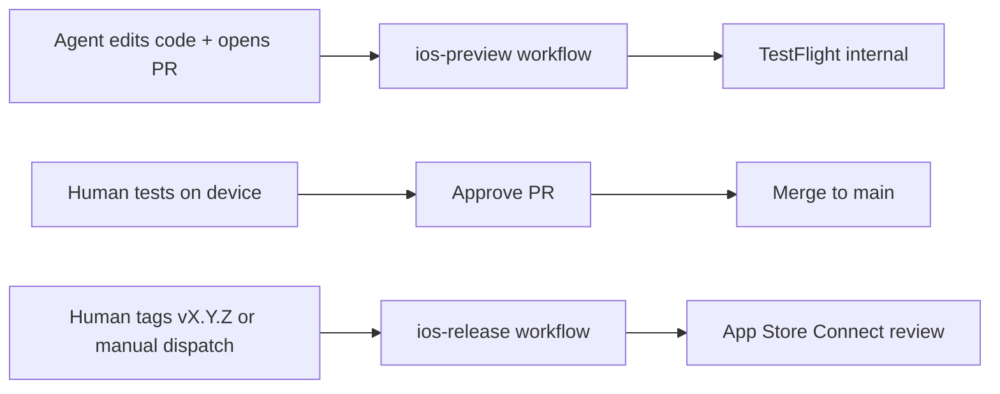

# Agent guide — MusicWall (iOS)

This repo is a **SwiftUI + MusicKit** iOS app. Most agent work is Swift source under `MusicWall/`. Builds, signing, and distribution run on **GitHub Actions (`macos-26`, Xcode 26)** — not on Linux cloud agents.

## CI/CD loop (human vs automation)



| Stage | Trigger | What runs | Human |
|-------|---------|-----------|-------|
| Fast feedback | PR + label `no-deploy` | Simulator build only (`ci_build`) | Optional |
| Feature validation | PR push (default) | match → build → **TestFlight internal** | **Test on device** before approving PR |
| Store release | Push tag `v*` (e.g. `v1.2.0`) or **Actions → iOS Release → Run workflow** with version `1.2.0` | Upload + **submit for review** | Approve release in App Store Connect |

**Rules for agents**

- Do **not** commit secrets, `.p8`, `.p12`, passwords, or `AuthKey_*` files.
- Do **not** commit `xcuserdata/` or `DerivedData/`.
- Do **not** change `DEVELOPMENT_TEAM` or bundle ID without explicit human request.
- Prefer small, focused PRs; one feature per PR when possible.
- If a change is docs-only or trivial, tell the human to add label **`no-deploy`** (or add it if you have permission) to skip TestFlight upload.

**PR comment bot** (after implementation): preview workflow posts TestFlight build number and status — reference that number in review notes.

## Project layout

```
MusicWall/                 # App source (SwiftUI views, services, models)
MusicWall.xcodeproj/       # Xcode project — scheme: MusicWall
fastlane/                  # match, build, upload lanes
.github/workflows/         # ios-preview.yml, ios-release.yml
docs/specs/                # Design specs
```

- **Bundle ID:** `chris.MusicWall`
- **Deployment target:** See `IPHONEOS_DEPLOYMENT_TARGET` in `project.pbxproj` (keep CI Xcode version compatible).
- **MusicKit:** Requires correct App ID capability; real playback/auth needs **device + TestFlight** — simulator is insufficient for full validation.

## iOS / Swift best practices (this codebase)

### Architecture

- **SwiftUI** for UI; use `@Observable`, `@State`, `@Environment` consistently with existing files.
- **MVVM-style separation:** views in `*View.swift`, Apple Music access in `MusicService.swift`, persistence in `UserDefaultsManager.swift` / `BackupService.swift`.
- Keep views thin; move testable logic into types/functions that do not require `MusicPlayer` when possible.

### MusicKit

- Use `MusicService` for catalog/library search — do not duplicate request types across views.
- Respect authorization flow in `ContentView` / entry points before calling catalog APIs.
- Do not log user tokens or private listening data.

### UI

- Reuse `LayoutViews` (grid/list), `SnackbarView`, `ImageCache` patterns.
- Support Dynamic Type and accessibility labels where you touch interactive controls.
- Avoid blocking the main actor in async MusicKit calls — use `async/await` as in existing code.

### Data & persistence

- Album collections use **UserDefaults** and backup JSON — preserve backward compatibility when changing encoded shapes.
- Version export/import via `BackupService` — test round-trip when changing `Album` model.

### Code quality

- Match existing naming and file placement; no drive-by refactors.
- Prefer compiler-driven safety over force-unwraps.
- Add **unit tests** in a future `MusicWallTests` target for pure logic (sorting, mapping, backup encoding) — not required for every UI tweak.

### Xcode project

- Target uses **filesystem-synchronized** `MusicWall/` group — new Swift files under `MusicWall/` are picked up automatically.
- Scheme: **MusicWall** (shared in `xcshareddata/xcschemes`).

## Working without local Xcode

Cloud agents on Linux can:

- Edit Swift, Markdown, workflows, Fastfile
- Run static reasoning and linters if configured

They **cannot** compile iOS binaries. **CI is the source of truth** for “does it build?”

Before marking work complete:

1. Ensure PR would pass **`ios-preview`** (or explain why `no-deploy` is appropriate).
2. Note any **MusicKit / device-only** verification for the human.
3. Never claim TestFlight or App Store success without workflow evidence.

## Git workflow

- Branch from `main`; use descriptive names (e.g. `cursor/feature-name-6cff` if following cloud agent convention).
- Do not push directly to `main` if branch protection is enabled.
- Release to App Store is **tag-driven** (`v1.2.0`), not merge-driven.

## Build numbers and versions

- **PR / TestFlight:** `CFBundleVersion` from Fastlane `resolve_build_number_for_upload` — **App Store Connect app-wide latest build + 1** (not per marketing version). Preview and release share this logic so build numbers never collide across workflows.
- **PR marketing version:** Fastlane `resolve_marketing_version_for_preview` reads the highest version on App Store Connect. If `MARKETING_VERSION` in the project is not **above** that (e.g. store already has 1.2), CI bumps the patch (→ 1.3) for the upload only. You do not need to bump the project after every shipped release for TestFlight to work.
- **Source of truth in git:** Keep `MARKETING_VERSION` in `project.pbxproj` at the version you are developing toward (currently **1.2**). After a store release, bump it when you start the next feature cycle (or let the first PR preview auto-select the next train).
- **Release tag `v1.2.0` or manual dispatch:** `CFBundleShortVersionString` = `1.2.0` from the tag/input; build number uses the same ASC lookup for that version.
- **Export compliance:** `ITSAppUsesNonExemptEncryption = NO` in the app Info.plist; TestFlight upload passes `uses_non_exempt_encryption: false` (App Store upload uses the plist only).

## Secrets (humans only)

Stored in GitHub → Settings → Secrets and variables → Actions:

| Secret | Purpose |
|--------|---------|
| `MATCH_PASSWORD` | Decrypt match cert repo |
| `MATCH_GIT_PRIVATE_KEY` | SSH deploy key (read cert repo) |
| `MATCH_GIT_URL` | `git@github.com:…/musicwall-match-certs.git` |
| `APP_STORE_CONNECT_API_KEY_KEY_ID` | App Store Connect API |
| `APP_STORE_CONNECT_API_KEY_ISSUER_ID` | App Store Connect API |
| `APP_STORE_CONNECT_API_KEY_CONTENT` | Base64 `.p8` key |

Agents: reference secret **names** only; never print or commit values.

## Specs and plans

- Design: `docs/specs/2026-05-24-ios-cicd-design.md`
- Implementation plan: `docs/plans/2026-05-24-ios-cicd.md`

## Common failures

| Symptom | Likely cause |
|---------|----------------|
| match fails on CI | Wrong `MATCH_PASSWORD` or deploy key |
| No profiles for MusicWall | MusicKit capability missing on App ID; re-run match on Mac |
| Upload rejected duplicate build | Build number collision — CI must increment `CFBundleVersion` |
| Music works in simulator but not TF | Test on **internal TestFlight** build, not simulator only |

When CI fails, read the Actions log for the `fastlane` step; fix code or ask the human to fix Apple portal/secrets — do not disable signing to “make green.”
