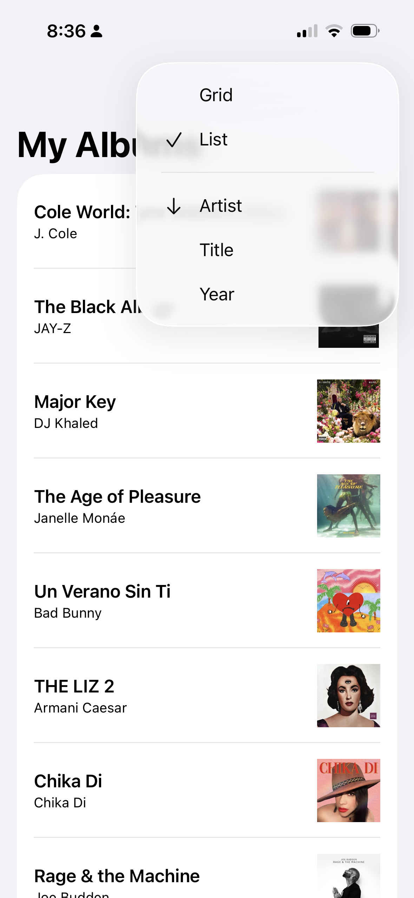

# MusicWall

## Overview

MusicWall is an iOS app that integrates with Apple Music to help users curate and visualize their album collection.

## Screenshots
<p align="middle">
  
   
</p>

## Key Features

- **Apple Music Integration**: Full integration with Apple MusicKit API for searching and playing music
- **Dual Search Capability**: Search both your personal music library and the Apple Music catalog
- **Flexible Layouts**: Switch between grid and list views for different browsing experiences
- **Smart Sorting**: Sort albums by artist, title, or release year with ascending/descending options
- **Persistent Storage**: Album collections are saved locally using UserDefaults with backup recovery
- **One-Tap Playback**: Play albums directly from the app using SystemMusicPlayer

## Technical Highlights

### Architecture & Design Patterns
- **SwiftUI**: Modern declarative UI framework
- **Observable Pattern**: Using `@Observable` macro for reactive state management
- **MVVM-inspired**: Clean separation of concerns with view models and service layers

### Key Technologies
- **SwiftUI**: User interface framework
- **MusicKit**: Apple Music API integration

### Technical Implementation Details
- Image caching for optimized album artwork loading
- State management with SwiftUI's `@State` and `@Environment`
- Snackbar notifications for user feedback

## Project Structure

```
MusicWall/
├── MusicWallApp.swift          # App entry point
├── ContentView.swift            # Main view with authorization handling
├── HomePageView.swift           # Primary album display interface
├── AlbumSearchView.swift        # Album search and selection
├── Album.swift                  # Data models and album management
├── MusicService.swift           # Apple Music API service layer
├── LayoutViews.swift            # Grid and list layout implementations
├── ImageCache.swift             # Album artwork caching
├── UserDefaultsManager.swift    # Data persistence utilities
└── SnackbarView.swift           # User notification component
```

## Requirements

- iOS 17.0+
- Xcode 15.0+
- Swift 5.9+
- Apple Music subscription (for catalog access)
- Apple Developer account (for MusicKit entitlements)

Shield: [![CC BY-NC-SA 4.0][cc-by-nc-sa-shield]][cc-by-nc-sa]

This work is licensed under a
[Creative Commons Attribution-NonCommercial-ShareAlike 4.0 International License][cc-by-nc-sa].

[![CC BY-NC-SA 4.0][cc-by-nc-sa-image]][cc-by-nc-sa]

[cc-by-nc-sa]: http://creativecommons.org/licenses/by-nc-sa/4.0/
[cc-by-nc-sa-image]: https://licensebuttons.net/l/by-nc-sa/4.0/88x31.png
[cc-by-nc-sa-shield]: https://img.shields.io/badge/License-CC%20BY--NC--SA%204.0-lightgrey.svg
