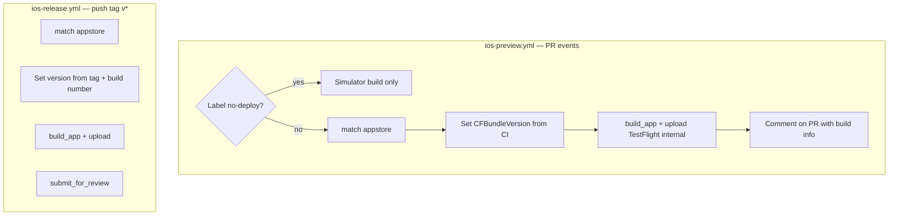

# iOS CI/CD Design — MusicWall

**Status:** Approved (2026-05-24)  
**Implementation style:** Fastlane-centric on GitHub-hosted `macos-15` runners  
**Signing:** fastlane match (private cert repository)

## Goals

1. Enable agentic development: agents open PRs; humans approve plans/PRs and test on device.
2. **PR pipeline:** On every push, build and upload to **TestFlight (internal testers only)**, unless PR has label `no-deploy`.
3. **Release pipeline:** On version tags (`v*`) on `main`, upload and **submit for App Store review**.
4. Same bundle ID (`chris.MusicWall`); monotonic **build numbers** from CI.
5. Public repo uses standard GitHub Actions macOS runners (no self-hosted Mac).

## Non-goals

- External TestFlight groups or beta review on every PR.
- App Store release on every merge to `main` (tags only).
- Per-PR bundle ID suffixes or side-by-side installs.
- Xcode Cloud as primary CI.
- Fork PRs running signing or upload workflows.

## Architecture

### Triggers

| Workflow | Event | Condition | Actions |
|----------|-------|-----------|---------|
| `ios-preview.yml` | `pull_request` (opened, synchronize, reopened) | Head repo == this repo | See label branch above |
| `ios-release.yml` | `push` tags matching `v*` | Tag on default branch history | match → build → upload → submit |

### Build numbering

- **Preview:** `CFBundleVersion = github.run_number` (or `10000 + run_number` if collision with past manual builds — pick one in implementation and document in `Agent.md`).
- **Release:** Same scheme; `CFBundleShortVersionString` parsed from tag (`v1.2.0` → `1.2.0`).
- Never reuse a build number already uploaded to App Store Connect for this bundle ID.

### Fastlane lanes (planned)

| Lane | Called by | Purpose |
|------|-----------|---------|
| `ci_build` | PR with `no-deploy` | Simulator build, no signing upload |
| `preview` | PR default | match → increment build → archive → TestFlight internal |
| `release` | Tag workflow | match → version from tag → archive → upload → submit_for_review |

### Security

- PR workflows that use secrets: `if: github.event.pull_request.head.repo.full_name == github.repository`.
- Do not use `pull_request_target` for signing/upload.
- Secrets only in GitHub Actions; never in repo files.
- Agents must not commit `.p8`, `.p12`, match password, or cert repo contents.

## Repository artifacts

| Path | Role |
|------|------|
| `.github/workflows/ios-preview.yml` | PR CI/CD preview |
| `.github/workflows/ios-release.yml` | Tag release |
| `fastlane/Appfile` | `app_identifier`, `team_id` from env |
| `fastlane/Matchfile` | Cert git URL, `appstore` type |
| `fastlane/Fastfile` | Lanes above |
| `Gemfile` / `Gemfile.lock` | Pin fastlane version |
| `.gitignore` | DerivedData, `xcuserdata`, fastlane reports, etc. |
| `Agent.md` | Agent conventions + CI/CD loop |
| `docs/specs/2026-05-24-ios-cicd-design.md` | This document |

### Optional follow-ups (not blocking v1)

- `MusicWall.xcconfig` + `DEVELOPMENT_TEAM` from env instead of hardcoding in `project.pbxproj`.
- Explicit `MusicWall.entitlements` for MusicKit if CI requires it.
- `MusicWallTests` target for simulator tests on `no-deploy` PRs.
- PR template with TestFlight checkbox.
- Branch protection requiring `ios-preview` check.

## GitHub Actions secrets

| Secret | Required | Purpose |
|--------|----------|---------|
| `MATCH_PASSWORD` | Yes | Decrypt match cert repository |
| `MATCH_GIT_PRIVATE_KEY` | Yes* | SSH deploy key (read-only) to clone cert repo |
| `APP_STORE_CONNECT_API_KEY_KEY_ID` | Yes | App Store Connect API |
| `APP_STORE_CONNECT_API_KEY_ISSUER_ID` | Yes | App Store Connect API |
| `APP_STORE_CONNECT_API_KEY_CONTENT` | Yes | Base64-encoded `.p8` contents |
| `DEVELOPMENT_TEAM` | Optional | `CD8XP2U645` if moved out of pbxproj |

\*Alternative: `MATCH_GIT_BASIC_AUTHORIZATION` (base64 `x-access-token:<PAT>`) instead of deploy key.

Workflows pass these to Fastlane via environment variables. Fastlane `app_store_connect_api_key` reads the same values.

## match private repository

- Dedicated **private** GitHub repository (e.g. `musicwall-match-certs`).
- Storage type: `appstore` only for v1.
- App identifier: `chris.MusicWall`.
- CI clones with deploy key; humans run `fastlane match appstore` locally for initial setup and yearly renewal.

## Human prerequisites (before first green CD run)

### Apple Developer & App Store Connect

1. Active **Apple Developer Program** for team `CD8XP2U645`.
2. **App ID** `chris.MusicWall` with **MusicKit** (Music identifier configured).
3. **App Store Connect** app record for that bundle ID.
4. **App Store Connect API key** (Admin or App Manager): download `.p8` once; record Key ID and Issuer ID.
5. **Internal TestFlight** access for your Apple ID on that app.
6. Decide **manual vs automatic** release after approval in App Store Connect (inform `submit_for_review` / release notes workflow).

### match (one-time on a Mac with Xcode)

7. Create empty **private** GitHub repository for certificates.
8. Install fastlane; after repo has `Matchfile`, run `fastlane match appstore` for `chris.MusicWall`.
9. Choose and save **match password** → GitHub secret `MATCH_PASSWORD`.
10. Add **read-only deploy key** on cert repo; private key → `MATCH_GIT_PRIVATE_KEY`.

### GitHub (MusicWall repo)

11. Add secrets listed above.
12. Create label **`no-deploy`** (description: skip TestFlight; simulator build only).
13. Confirm repository is **public** (macOS runner cost assumption).

### Verification

14. Open a test PR without `no-deploy`; confirm TestFlight build appears for internal testers.
15. Tag `v0.0.0-test` on a branch only if needed for dry-run; production tags use semver `v1.2.0`.

## PR conventions

- **Default:** Every push uploads a new internal TestFlight build.
- **`no-deploy` label:** Docs/metadata-only changes; faster simulator build, no match/upload.
- **Review:** Human validates feature on TestFlight build number noted in PR comment before merge.
- **Agents:** Edit Swift and workflows; never add secrets to git.

## Release conventions

- Merge features to `main` via PR (TestFlight already validated on PR).
- When ready for store: tag `v<major>.<minor>.<patch>` on `main` → `ios-release.yml` uploads and submits for review.
- Human monitors App Store Connect for review outcome and release.

## Error handling

| Failure | Behavior |
|---------|----------|
| match clone/decrypt fails | Fail job; log "check MATCH_PASSWORD / deploy key" |
| Code signing / profile mismatch | Fail job; re-run match on Mac with MusicKit capability |
| Upload succeeds, processing pending | PR comment notes processing; link to ASC |
| Duplicate build number | Fail upload; increment scheme documented in Fastfile |
| Tag not semver | Release workflow should fail fast with clear message |

## Testing strategy

| Layer | Where | When |
|-------|-------|------|
| Compile (simulator) | `ci_build` | PR with `no-deploy` |
| Compile + sign + upload | `preview` | PR default |
| Unit tests | Future `MusicWallTests` | Add to `ci_build` and `preview` when target exists |
| MusicKit playback / auth | Physical device | Human on TestFlight PR build |

## Related documents

- Root **`Agent.md`** — agent-facing summary and loop.
- Implementation plan: **`docs/plans/2026-05-24-ios-cicd.md`** (created after spec review).
